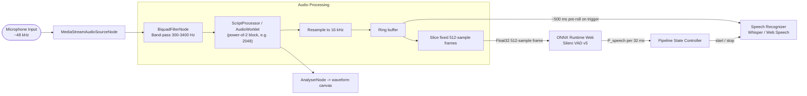
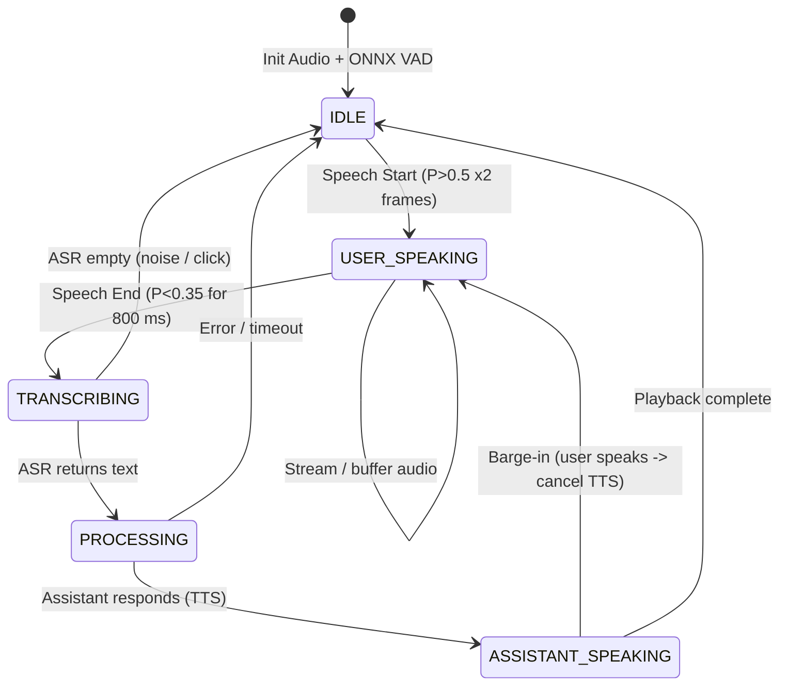
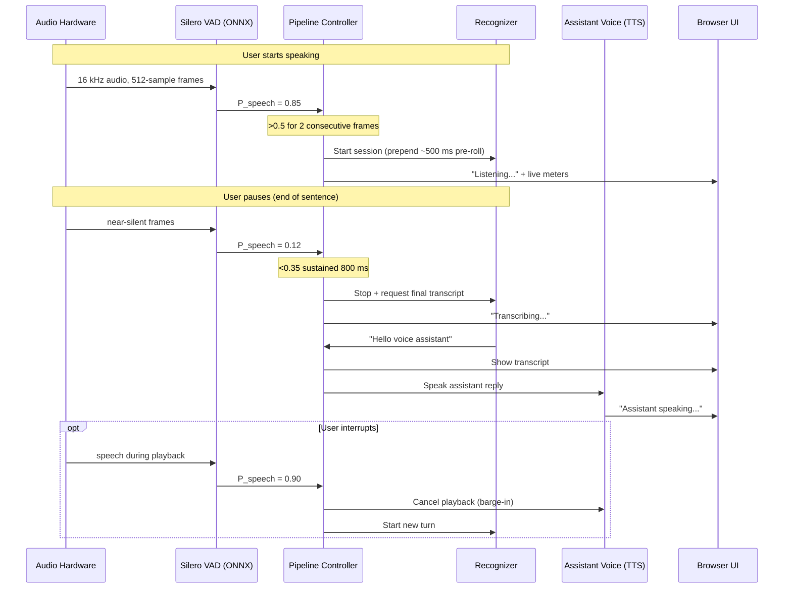

# Architecture Diagram: Client-Side VAD & Speech Recognition

**Challenge 2 — Deliverable (Architecture Diagram)** · Supports **Tasks 1–4**

> **What this document covers:** three views of the same system — the **audio node graph** (how sound flows), the **state machine** (how the conversation is governed), and the **event sequence** (what happens during one utterance). Read the Technical Design Document first for the VAD/ASR rationale.

---

## 1. Web Audio Node Graph

Raw microphone audio is filtered, resampled to 16 kHz, and sliced into fixed **512-sample** frames for Silero VAD. A ring buffer holds recent audio for pre-roll.

> **Two things the original diagram got wrong, now fixed:** (1) frames are **512 samples**, not 1536 — Silero v5's fixed requirement; (2) the audio block size and the model frame size are **decoupled** via the ring buffer, because the ScriptProcessor block must be a power of two while the model needs exactly 512.

---

## 2. Pipeline State Machine

The controller governs every transition. Note the **barge-in edge** (`ASSISTANT_SPEAKING → USER_SPEAKING`) — the reliability feature the PoC demonstrates live.

---

## 3. Real-Time Conversational Event Flow

One full turn, including the assistant's spoken reply and a possible barge-in.

