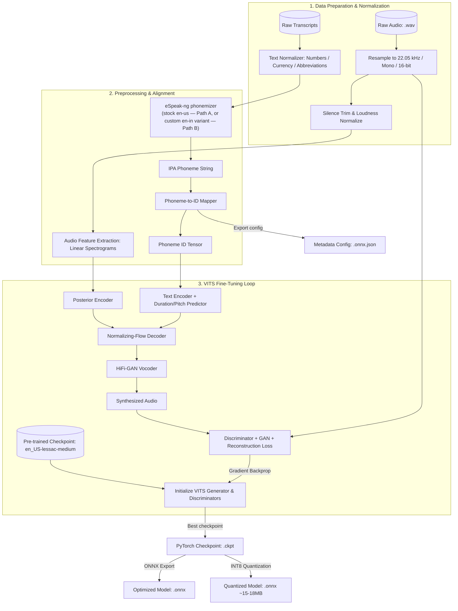
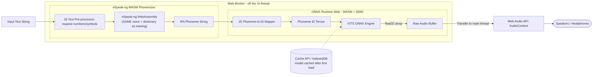

# Architecture Diagram: Indian English Piper TTS Adaptation

**Challenge 1 — Deliverable 2 of 4** · Supports **Tasks 1–4**

> **What this document covers:** two block diagrams — the **offline** training/fine-tuning pipeline (how the voice is built) and the **online** browser inference pipeline (how it runs client-side) — plus component notes. Read the Technical Design Document first for the conceptual split (eSpeak-ng = phonemes, VITS = audio).

---

## 1. Offline Training & Fine-Tuning Pipeline

Raw audio + transcripts are transformed into a specialized VITS checkpoint and exported to ONNX for the browser.

---

## 2. Client-Side Browser Inference Pipeline

Everything runs locally in the browser — no server round-trip. Inference happens on a Web Worker so the UI never blocks.

> **The two diagrams must agree at the eSpeak box.** The browser phonemizer (right) must use the *identical* eSpeak-ng voice and dictionary as the training pipeline (left). This is the single most important cross-pipeline invariant — a mismatch feeds the model phoneme IDs it never saw in training.

---

## 3. Component Details & Pipeline Flow

### A. Data Prep & Preprocessing
* **Audio resampler** — standardizes voice data to 22,050 Hz, mono, 16-bit PCM, matching Piper's `medium` quality tier.
* **eSpeak-ng (native & WASM)** — converts text to IPA phonemes. Training uses the native CLI/library; the browser uses an Emscripten-compiled WASM module of the *same* eSpeak version and dictionary.

### B. VITS Neural Network Structure
* **Text encoder** — projects phoneme IDs into hidden linguistic representations.
* **Duration / pitch predictor** — predicts per-phoneme timing and the F0 (pitch) contour; this is where Indian cadence and intonation are learned.
* **Posterior encoder** — used only in training, encodes structure from ground-truth audio spectrograms.
* **Normalizing flow** — bridges the simple text representation to the complex target audio distribution.
* **HiFi-GAN vocoder** — the decoder; turns features into a time-domain waveform.

### C. ONNX Runtime Web Execution
* **Model serialization** — the full VITS generator (flow decoder + HiFi-GAN) exports as one `.onnx` file; INT8-quantized to ~15–18 MB for the web.
* **Web Workers** — inference runs on a background thread so the UI never freezes.
* **Web Audio API** — the raw float32 output streams straight to the audio device with low latency (target < 150 ms to first audio).
* **Caching** — the model is cached in Cache API / IndexedDB after first download, so repeat visits load instantly and offline.
